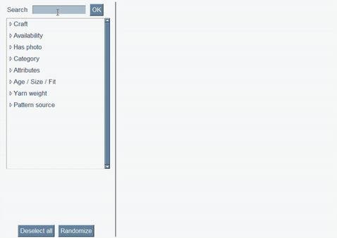

# Ravelry Pattern Randomizer
An application to fetch a random pattern from Ravelry's database matching any number of queries selected by the user, built using the [Ravelry API](https://www.ravelry.com) and [PySimpleGUI](https://github.com/PySimpleGUI/PySimpleGUI).

Customise based on craft, availability, category, attributes, yarn weight, fit, and pattern source.
 
 

